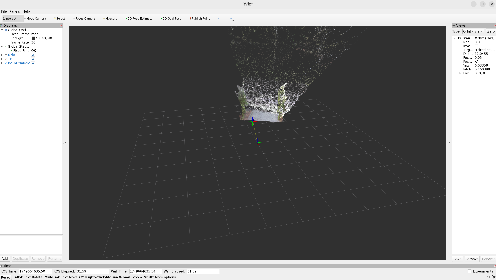
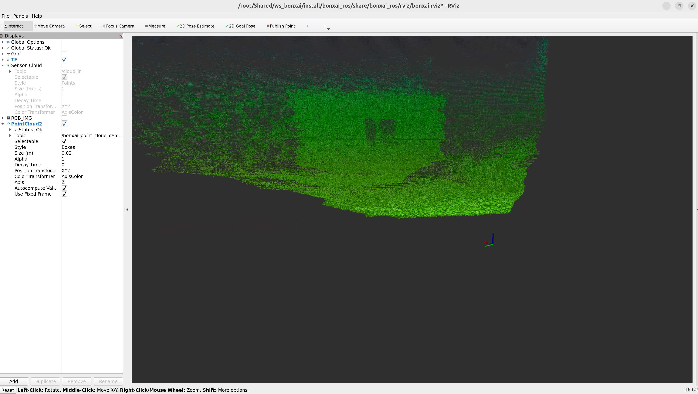

## 📦 Opis

Repozytorium zajmuje się instalacją i obsługą trzech kamer RGB-D, których dane zostaną wykorzystane do budowy map 3D w celu porównania różnych metod.

**Kamery obsługiwane:**
- Kamera 1 – Azure Kinect DK
- Kamera 2 – Orbbec Femto Mega
- Kamera 3 – Intel RealSense Depth Camera D435

**Paczki ROS 2:**
- `fix_tf_map` – paczka służąca do łączenia transformacji (TF) kamery z danymi współrzędnymi z GPS
- `start_camera` – paczka pozwalająca uruchomić kamerę z odpowiednimi ustawieniami oraz nagrywać dane do plików `rosbag`

### Wymagania:
- Docker
- System z obsługą USB

---

## 📥 Pobierz repozytorium

```bash
git clone https://github.com/KsaweryAiR/Comparison-of-RGB-D-cameras-and-3D-map-construction-methods.git
```

```bash
cd Comparison-of-RGB-D-cameras-and-3D-map-construction-methods/
```

---

## 🐳 Docker – Instalacja dla każdej kamery

---

### 1️⃣ Azure Kinect DK

#### 🔧 Budowanie obrazu (Podłącz Azure Kinect DK do USB, a inne odłącz!)

```bash
cd camera_installer/kinect-camera-docker/
```

```bash
docker build -t kinect_rviz .
```

#### 🚀 Uruchamianie kontenera

```bash
bash run_docker.sh
```

##### ✅ Akceptacja i instalacja zasad użytkowania (w kontenerze):

```bash
cd azure_kinect_notes
```

```bash
bash install_azure_kinect_camera_u_22.04.sh
```

##### 🔨 Budowa paczki ROS drivera dla Kinecta:

```bash
cd ../ros2_ws
```

```bash
source /opt/ros/humble/setup.bash
```

```bash
colcon build
```

```bash
source install/setup.bash
```

---

### 2️⃣ Orbbec Femto Mega

#### 🔧 Budowanie obrazu (Podłącz Orbbec Femto Mega do USB, a inne odłącz!)

```bash
cd camera_installer/orbbec-camera-docker/
```

```bash
docker build -t orbbec_rviz .
```

#### 🚀 Uruchamianie kontenera

```bash
bash run_docker.sh
```

Gotowe do działania! ✅

---

### 3️⃣ Intel RealSense D435

#### 🔧 Budowanie obrazu (Podłącz Intel RealSense D435 do USB, a inne odłącz!)

```bash
cd camera_installer/intel-camera-docker/
```

```bash
docker build -t intel_rviz .
```

#### 🚀 Uruchamianie kontenera

```bash
bash run_docker.sh
```

Gotowe do działania! ✅

---

### 📸 Po instalacji można podłączyć wszystkie kamery jednocześnie



---

### 🗺️ Zebrane dane można wykorzystać do budowy map 3D

**Bonxai**  
Repozytorium: [https://github.com/facontidavide/Bonxai](https://github.com/facontidavide/Bonxai)

**UFOMap**  
Repozytorium: [https://github.com/UnknownFreeOccupied/ufomap](https://github.com/UnknownFreeOccupied/ufomap)

  



